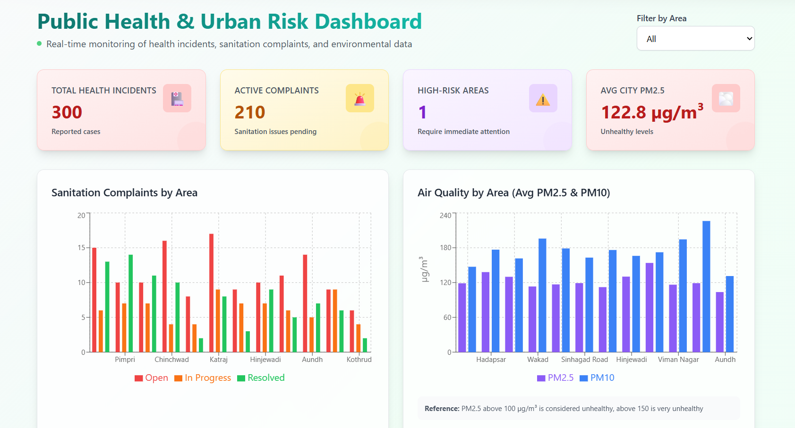
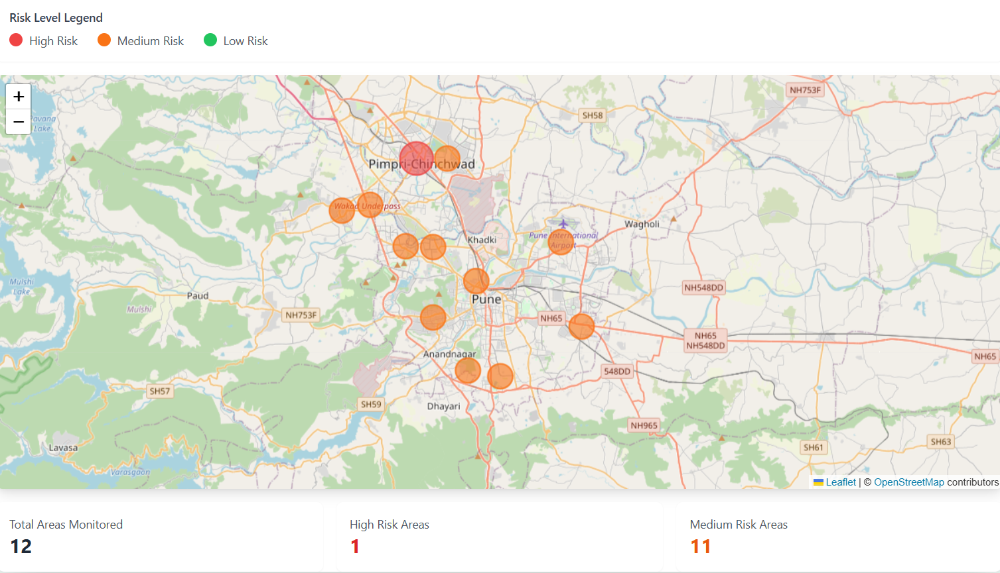
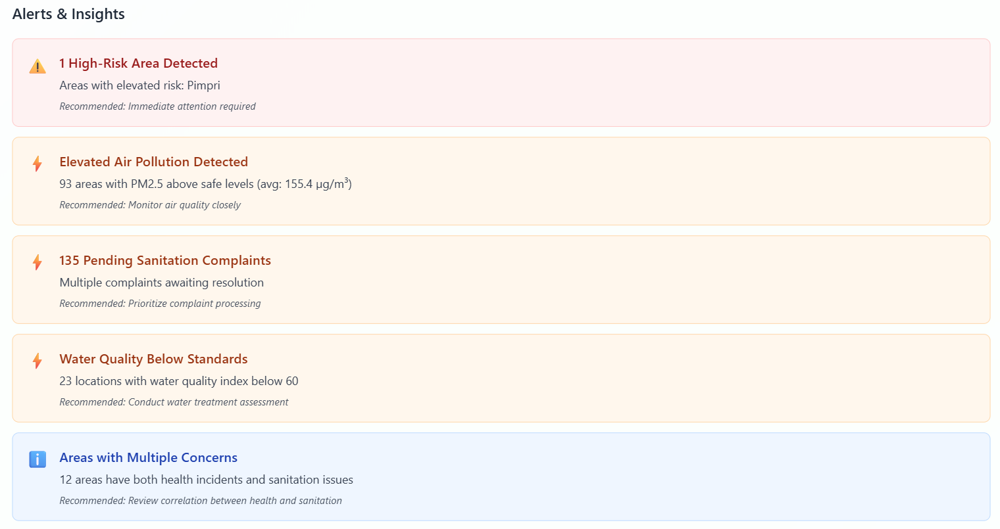

# Problem Statement : Open Bharat
### Anything that makes India Better

### Project Title: AI-Driven Public Health & Urban Risk Dashboard

### 🎥 Demo Video
👉 [Watch the Demo](https://drive.google.com/file/d/1n-cw1LkdeD85SNXbAoseyAnKgJ_MeZuT/view?usp=sharing)


## HealthPulse
## Public Health & Urban Risk Dashboard

### 🌐 Live Demo
👉 **Frontend**: [https://hack-x-india-hackathon-2026-nu.vercel.app/](https://hack-x-india-hackathon-2026-nu.vercel.app/)  
👉 **Backend API**: [https://hackxindia-hackathon-2026-1.onrender.com/api/sanitation-complaints](https://hackxindia-hackathon-2026-1.onrender.com/api/sanitation-complaints)  
👉 **GitHub Repository**: [https://github.com/Aashu-1911/HackXIndia-Hackathon-2026](https://github.com/Aashu-1911/HackXIndia-Hackathon-2026)

HealthPulse is a modern, data-driven platform designed to monitor and predict public health risks in urban areas. By integrating real-time data on health incidents, sanitation complaints, and environmental factors, HealthPulse leverages advanced Machine Learning to forecast disease outbreak risks, empowering authorities to take proactive measures.

### Features
*   **🏥 Health Incident Monitoring**: Track reported cases of diseases like Dengue and Malaria in real-time.
*   **🚨 Sanitation Complaint Tracking**: Monitor and manage urban sanitation issues reported by citizens.
*   **🌫️ Environmental Analysis**: Visualize air quality trends (PM2.5, PM10) and their correlation with health risks.
*   **🤖 AI-Powered Outbreak Prediction**: Uses ML models (Gradient Boosting) to predict outbreak risks based on historical and current data.
*   **🗺️ Interactive Risk Map**: Geospatial visualization of high-risk zones and hot-spots.
*   **📊 Admin Dashboard**: Key Performance Indicators (KPIs) and interactive charts for decision-makers.
*   **🔐 Role-Based Access**: Secure authentication with distinct views for Admins (Dashboard access) and Users (Map view).

### Screenshots


*Admin Dashboard showing health KPIs and analytics*


*Interactive Risk Map highlighting incident zones*


*Detailed breakdown of environmental and health trends*

### Tech Stack

#### Frontend
*   **Framework**: React (Vite)
*   **Styling**: Tailwind CSS
*   **Visualization**: Recharts, React-Leaflet
*   **State Management**: Context API

#### Backend
*   **Runtime**: Node.js
*   **Framework**: Express.js
*   **Security**: JWT (JSON Web Tokens), Bcrypt
*   **Data Processing**: Child Process (for Python ML integration)

#### Database
*   **Database**: MongoDB (Atlas)
*   **ODM**: Mongoose

#### Machine Learning
*   **Language**: Python
*   **Libraries**: Scikit-Learn, CatBoost, Pandas, NumPy, Joblib
*   **Tasks**: Data Preprocessing, Risk Classification

### Getting Started

#### Prerequisites
*   Node.js (v14+)
*   Python (v3.8+)
*   MongoDB Connection String

#### Installation

1.  **Clone the repository**
    ```bash
    git clone https://github.com/Aashu-1911/HackXIndia-Hackathon-2026.git
    cd HackXIndia-Hackathon-2026
    ```

2.  **Backend Setup**
    ```bash
    cd backend
    npm install
    
    # Create a .env file in the backend directory with:
    # PORT=5000
    # MONGODB_URI=your_mongodb_connection_string
    # JWT_SECRET=your_jwt_secret_key
    # FRONTEND_URL=http://localhost:5173
    
    # Start the backend server
    npm run dev
    ```

3.  **ML Environment Setup**
    The backend communicates with Python scripts for predictions. Ensure dependencies are installed.
    ```bash
    cd ../ml
    
    # Create and activate virtual environment (Recommended)
    python -m venv env
    # Windows: env\Scripts\activate
    # Mac/Linux: source env/bin/activate
    
    # Install ML dependencies
    pip install -r requirements.txt
    ```

4.  **Frontend Setup**
    ```bash
    cd ../frontend
    npm install
    
    # Start the development server
    npm run dev
    ```

5.  **Access the Application**
    *   Open your browser and navigate to `http://localhost:5173`
    *   Login with Admin credentials to view the dashboard or register as a User for the map view.

### Contributing
Contributions are welcome! Please open issues or pull requests for improvements, bug fixes, or new features.

---
Made with ❤️ by the Team Srujan.


